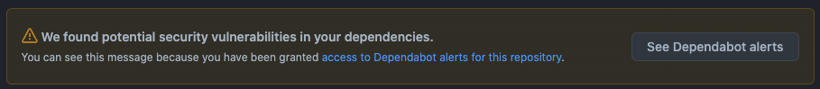
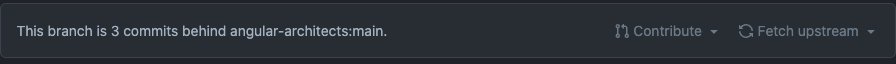
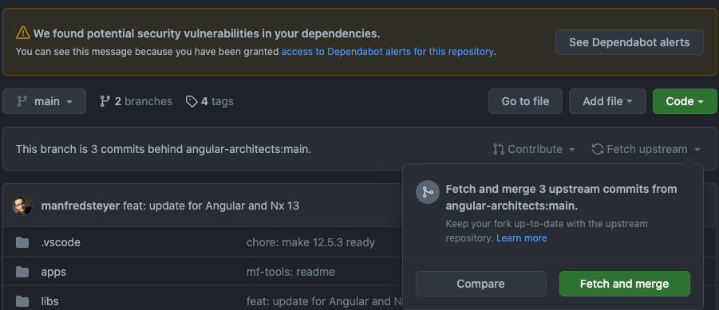

# Reference Architecture - Microfrontends

This repository is forked from [angular-architects/module-federation-plugin](https://github.com/angular-architects/module-federation-plugin)

- See [@angular-architects/module-federation](./libs/mf/README.md)

## How to Sync this repo with its public counterpart

In order to maintain our Iberia fork up to date it is required to **resync** with the parent repository. 

The optimal way to do it is to set-up an automatic process but for now we will need to be aware of this situation. How to detect it?
- **GitHub Dependabot** is showing vulnerabilities. This project is well maintained and usually new updates are deployed quickly.

- GitHub itself will tell us that we are behind:

**Fetch and merge** a fork is an easy process that it's already documented by GitHub: [Syncing a fork](https://docs.github.com/en/pull-requests/collaborating-with-pull-requests/working-with-forks/syncing-a-fork)

> This situation being behind already happened and it was resolved above instructions. In this case we used GitHub direct functionality: *Fetch and merge*
> 