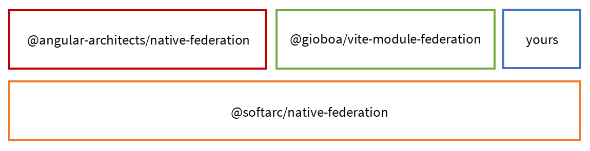

# @softarc/native-federation

Native Federation is a "browser-native"  implementation of the successful mental model behind wepback Module Federation for building Micro Frontends. It can be **used with any framework and build tool** for implementing **Micro Frontends** and plugin-based architectures.

## Features

- ✅ Mental Model of Module Federation
- ✅ Future Proof: Independent of build tools like webpack and frameworks
- ✅ Embraces Import Maps - an emerging browser technology
- ✅ Easy to configure
- ✅ Blazing Fast: The reference implementation not only uses the fast esbuild; it also caches already built shared dependencies (like Angular itself). However, as mentioned above, feel free to use it with any other build tool.

## Stack

This library allows to augment your build process, to configure hosts (Micro Frontend shells) and remotes (Micro Frontends), and to load remotes at runtime.

While this core library can be used with any framework and build tool, there is a higher level API on top of it. It hooks into the Angular CLI and provides a builder and schematics:



> Please find the [Angular-based version here](https://www.npmjs.com/package/@angular-architects/native-federation).

Also, other higher level abstractions on top of this core library are possible. 

## Example 

Please find here an [example project](https://github.com/manfredsteyer/native-federation-core-microfrontend).

## Credits

Big thanks to:

- [Zack Jackson](https://twitter.com/ScriptedAlchemy) for originally coming up with the great idea of Module Federation and its successful mental model
- [Tobias Koppers](https://twitter.com/wSokra) for helping to make Module Federation a first class citizen of webpack
- [Florian Rappl](https://twitter.com/FlorianRappl) for an good discussion about these topics during a speakers dinner in Nuremberg 
- [The Nx Team](https://twitter.com/NxDevTools), esp. [Colum Ferry](https://twitter.com/FerryColum), who seamlessly integrated webpack Module Federation into Nx and hence helped to spread the word about it (Nx + Module Federation === ❤️)
- [Michael Egger-Zikes](https://twitter.com/MikeZks) for contributing to our Module Federation efforts and brining in valuable feedback
- The Angular CLI-Team, esp. [Alan Agius](https://twitter.com/AlanAgius4) and [Charles Lyding](https://twitter.com/charleslyding), for working on the experimental esbuild builder for Angular

## Using this Library

### Augment your Build Process

Just call three helper methods provided by our ``federationBuilder`` in your build process to adjust it for Native Federation.

```typescript
import * as esbuild from 'esbuild';
import * as path from 'path';
import * as fs from 'fs';
import { esBuildAdapter } from './esbuild-adapter';
import { federationBuilder } from '@softarc/native-federation/build';


const projectName = 'shell';
const tsConfig = 'tsconfig.json';
const outputPath = `dist/${projectName}`;

/*
    *  Step 1: Initialize Native Federation
*/

await federationBuilder.init({
    options: {
        workspaceRoot: path.join(__dirname, '..'),
        outputPath,
        tsConfig,
        federationConfig: `${projectName}/federation.config.js`,
        verbose: false,
    },

    /*
        * As this core lib is tooling-agnostic, you
        * need a simple adapter for your bundler.
        * It's just a matter of one function.
    */
    adapter: esBuildAdapter
});

/*
    *  Step 2: Trigger your build process
    *
    *   You can use any tool for this. 
    *   Here, we go with a very simple esbuild-based build.
    * 
    *  Just respect the externals in 
    *  `federationBuilder.externals`.
*/

[...]

await esbuild.build({
    [...]
    external: federationBuilder.externals,
    [...]
});

[...]

/*
    *  Step 3: Let the build method do the additional tasks
    *       for supporting Native Federation
*/

await federationBuilder.build();
```

The method ``federationBuilder.build`` bundles the shared and exposed parts of your app. For this, it needs a bundler. As this solution is tooling-agnostic, you need to provide an adapter for your bundler:

```typescript
import { BuildAdapter } from '@softarc/native-federation/build';
import * as esbuild from 'esbuild';

export const esBuildAdapter: BuildAdapter = async (options) => {
  
    const {
      entryPoint,
      external,
      outfile,
    } = options;
    
    await esbuild.build({
      entryPoints: [entryPoint],
      external,
      outfile,
      bundle: true,
      sourcemap: true,
      minify: true,
      format: 'esm',
      target: ['esnext']
    });
  }
```

### Configuring Hosts 

The ``withNativeFederation`` function sets up a configuration for your applications. This is an example configuration for a host:

```typescript
// shell/federation.config.js

const {
  withNativeFederation,
  shareAll,
} = require("@softarc/native-federation/build");

module.exports = withNativeFederation({
  name: "host",

  shared: {
    ...shareAll({
      singleton: true,
      strictVersion: true,
      requiredVersion: "auto",
      includeSecondaries: false,
    }),
  },

});
```

The API for configuring and using Native Federation is very similar to the one provided by our Module Federation plugin @angular-architects/module-federation. Hence, most the articles on it are also valid for Native Federation.

### Sharing

The ``shareAll``-helper used here shares all dependencies found in your ``package.json`` at runtime. Hence, they only need to loaded once (instead of once per remote and host). If you don't want to share them all, you can opt-out of sharing by using the ``skip`` option:

```typescript
module.exports = withNativeFederation({
  [...]

  // Don't share my-lib
  skip: [
    'my-lib'
  ]

  [...]
}
```

Also pahts, mapped in your ``tsconfig.json`` are shared by default. They are treaded like libraries:

```json
{
  "compilerOptions": {
    [...]
    "paths": {
      "shared-lib": [
        "libs/shared-lib/index.ts"
      ]
    }
  }
}
```

If you don't want to share (all of) the, put their names into the skip array (see above).

### Configuring Remotes

When configuring a remote, you can also expose files that can be loaded into the shell at runtime:

```javascript
const {
  withNativeFederation,
  shareAll,
} = require("@softarc/native-federation/build");

module.exports = withNativeFederation({
  name: "mfe1",

  exposes: {
    "./component": "./mfe1/component"
  },

  shared: {
    ...shareAll({
      singleton: true,
      strictVersion: true,
      requiredVersion: "auto",
      includeSecondaries: false,
    }),
  },

});
```

### Initializing a Host

On startup, call the ``initFederation`` method. It takes a mapping between the names of remotes and their ``remoteEntry.json``. This is a file containing meta data. It's automatically generated by the augmented build process (see above).

```typescript
import { initFederation } from '@softarc/native-federation';

(async () => {

    await initFederation({
        "mfe1": "http://localhost:3001/remoteEntry.json"
    });
    
    await import('./app');

})();
```

You can also pass the name of a file with the key data about your remotes:

```typescript
import { initFederation } from '@softarc/native-federation';

(async () => {

    await initFederation('assets/manifest.json');
    
    await import('./app');

})();
```

Following the idea of our friends at Nrwl, we call such a file a manifest:

```json
{
        "mfe1": "http://localhost:3001/remoteEntry.json"
}
```

Manifests allow to adjust your application to different environments without any recompilation.

## Initializing a Remote

Also for initializing a remote, call ``initFederation``. If you don't plan to load further remotes into your remote, you don't need to pass any data to ``initFederation``:

```typescript
import { initFederation } from '@softarc/native-federation';

(async () => {

    await initFederation();
    await import('./component');

})();
```

### Loading a Remote

To load a remote, just call the ``loadRemoteModule`` function:

```typescript
const module = await loadRemoteModule({
    remoteName: 'mfe1',
    exposedModule: './component'
});
```

If you know the type of the loaded module (perhaps you have a shared interface), than you can use it as a type parameter:

```typescript
const module = await loadRemoteModule<MyRemoteType>({
    remoteName: 'mfe1',
    exposedModule: './component'
});
```